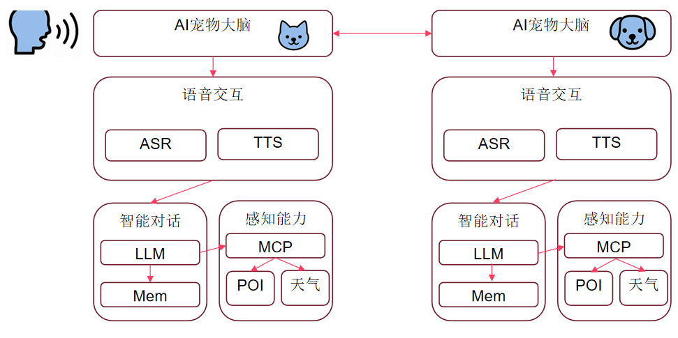

# rana_server_about_gemini

## Rana：AI 宠物

采用LLM、MCP、ASR等AI技术，构建“AI宠物大脑”，实现智能对话和感知能力，旨在创造一个既能提供情感慰藉，又能满足实际需求的未来宠物。

## 项目介绍

Rana项目服务器模块，调用LLM等接口，并开放接口给客户端调用

## 技术流程图：

## 涉及Google的技术：（已完成√）

1. Gemini：Agent所用的基座大语言模型 √
2. Vertex AI Agent Builder: 创建宠物Agent
3. Agent2Agent (A2A)：宠物Agent之间的对话
4. MCP：Cloud Run MCP Server：用于调用第三方服务 √
5. Google Cloud：Speech-to-Text AI， Text-to-Speech AI：用于用户语音转文本（给Agent）和（Agent反馈的）文本转语音
6. 待定：图像识别（Cloud Vision API , Video Intelligence API, 人脸表情检测as情绪识别）：用于识别用户表情情绪和当前环境

